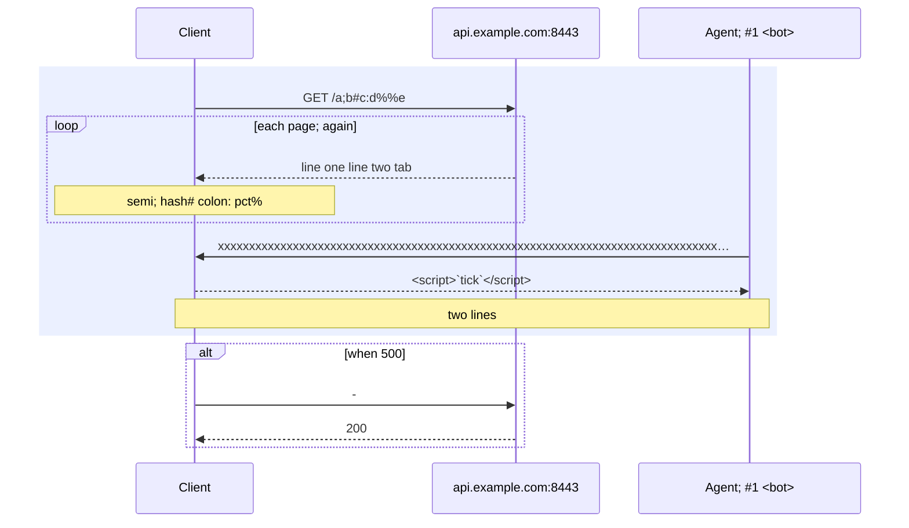

```mermaid
sequenceDiagram
    participant P0 as Client
    participant P1 as api.example.com#58;8443
    participant P2 as Agent#59; #35;1 #lt;bot#gt;
    rect rgb(235, 240, 255)
        %% flow node
        P0->>P1: GET /a#59;b#35;c#58;d#37;#37;e
        loop each page#59; again
            P1-->>P0: line one line two tab
            Note over P0: semi#59; hash#35; colon#58; pct#37;
        end
        P2->>P0: xxxxxxxxxxxxxxxxxxxxxxxxxxxxxxxxxxxxxxxxxxxxxxxxxxxxxxxxxxxxxxxxxxxxxxxxxxxxxxxx…
        P0-->>P2: #lt;script#gt;#96;tick#96;#lt;/script#gt;
        Note over P2,P0: two lines
    end
    alt when 500
        P0->>P1: -
        P1-->>P0: 200
    end
```
